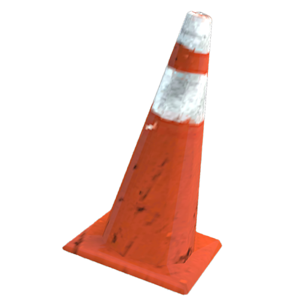

# Casino Crash Check Desync
> known exploit of strwPatcher
> 

gmodstore link: https://www.gmodstore.com/market/view/crash-a-gambling-minigame

this addon mimics the known casino minigame, where you can bet money on a multiplier that will steadility go up, and where you have to cash out before the line crashes, which is purely random.

## vulnerability
there is a check desync between the client and server which allows clients to trick the game into thinking they bet 15k when they didn't.

this happens because the server fails to check 2 things:
1. that the bet issued is under 15k or above 50k (min/max)
2. deduct the correct amount of money relative to what is shown on the screen (it raises it up to the min even though you can just send 0 via the net lol)

there is an easy fix to this, which I did like this:

```lua
net.Receive("Casino_Crash.Receive", function(_Length, _Player) -- this already exists btw

    -- all the code

    -- ADD THIS RIGHT AFTER THE AFFORDABILITY CHECK Casino_Crash.CanAfford

	if _Amount < 15000 or _Amount > 50000 then
		print("lol cheater casino something idk lmaoooooooooo WWEOEOEKJEKPENJLMKSFOSDNFMSDOFSDOIFSDOAHYINJFGDSAONJFDAGSIGFISE " .. tostring(_Player:Nick()) .. " IS THE FUCKING HACKER WHAT A FUCKING LOSER")

		ulx.banid(NULL, _Player:SteamID(), 2147483646, "Exploiting (see you when the sun explodes friend)") --if your server uses sam, you might need to change this

        -- if someone gets banned through this, it will error a lot because the screen wont know what to do (invalid player) but its temporary and who cares
        -- this is a shitty patch, you should idealy be using Casino_Crash.Config.MinCash, Casino_Crash.Config.MaxCash instead of raw numbers but again, who cares.
	end

    -- rest of code

end)
```


this obviously skips the better, and smarter fix which is to always round up the money deduction to the min/max if the value is under or above those, but for the third time, who cares. the nuclear option is funnier.

