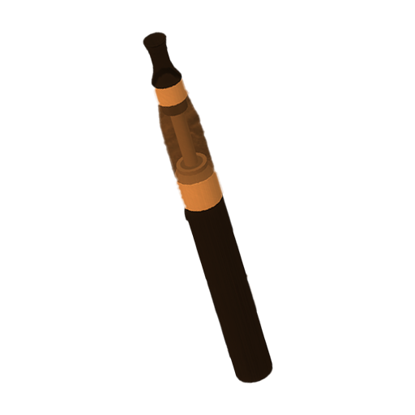

# Dragon Vape Ignite
> known exploit of strwPatcher
> 

workshop: https://steamcommunity.com/sharedfiles/filedetails/?id=673698301

allows players to hold cool vapes, some of which have cool utility value such as setting people on fire, flying, creating massive smoke screens and more.

## vulnerability
hi creator of this addon, if you're reading this, your comment of "I hope there's no exploits" turned out to bite you in the ass, because there is an exploit! you never check if the particles hit the player on the serverside, which I mean, its kind of annoying to do eitherway, so I dont blame you.

basically, you can set people on fire if you hold out a vape and they're close enough, skipping having to aim the flame particles at people. there is already a lot of checks in place (good job btw), but i would recommend just nuking that net. it's a stupid concept for an admin weapon, and if there ever is an exploit to spawn in stuff, this can be abused, as seen by admen (god bless)

REMOVE ANYTHING WITH THIS NET: DragonVapeIgnite
