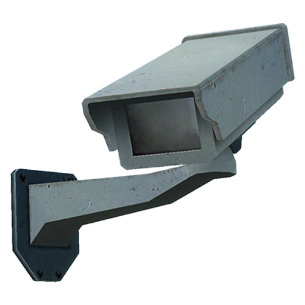

# Rogue Scoreboard Hide Name (might be #Accidentally patched?)
> known exploit of strwPatcher
> 

gmodstore: https://www.gmodstore.com/market/view/rogue-scoreboard

adds a modern scoreboard, replacing the old gmod one with something more fresh with administrative integration, darkrp integration and more.

## vulnerability
you can hide your name from the scoreboard as a non-admin, which obviously presents a security flaw.

fortunately, this is fixed in the newer versions of rogue scoreboard, so make sure to download the newest version. if you're using a cracked version, too bad, go buy the addon (to be fair, a monkey could fix this, 1 line fix btw)

link: https://www.gmodstore.com/market/view/rogue-scoreboard
