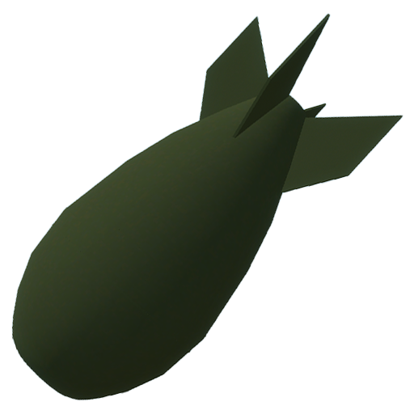

# Spawner
> category for strwPatcher
> 

this section is for exploits that allow you to spawn in guns (directly or indirectly), entities, npcs and more.

if an exploit was marked and is under this section, you may now know why some random russian child joins randomly at 1am to spawn 5000 tsar bombs to crash ur server.

## index
below you can find an index of all known exploits under this section
- VJ Base Entity Spawner
- SCP178 Spawner
- Webscreen Exploit
- Direct Weapon Giver (KShop)
- SCP 939 Eggs
- Summe Entity Spawner
- Summe Droid Spawner
- NPC Tool (1) NPC Spawner
- Administrative Item Spawn Menu
